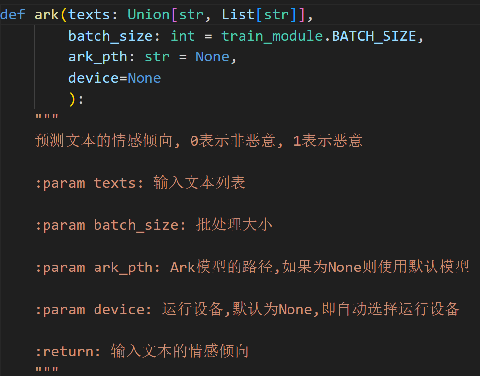

# 介绍

ark是一个基于深度学习的恶意语义识别模型，它可以识别常见的网络恶意，包括使用谐音规避检测的恶意语言。

ark致力于维护网络环境，减少恶意评论的传播，减少网络暴力的发生。

ark主要采用注意力机制训练，并使用多特征交叉学习的方式提升模型的理解能力。

# 安装

要求**python3.9**及以上

### github

```commandline
git clone https://github.com/aurshine/ark.git
cd ark
pip install -i https://pypi.tuna.tsinghua.edu.cn/simple -r requirements.txt
```

# 训练

```python
from ark import train, pre_train

# 训练模型
train()

# 训练预训练模型
# pre_train()
```

1. 在**./ark/train_module.py**下可配置模型参数和训练参数
    
    
2. 在**./ark/data/DATASET/all_data**下可添加自己的**csv文件格式**训练集，csv头为`text    label`
   
3. **train**函数签名
    
4. **pre_train**函数签名
    

# 预测

```python
from ark import ark

print(ark(['原神启动', 
           '小亮来给他整个活', 
           '团长你就是歌姬吧', 
           '你是真没见过黑社会啊?三天之内杀了你'], device='cpu'))
```



# 详细

见[ark详细设计](ark.md)