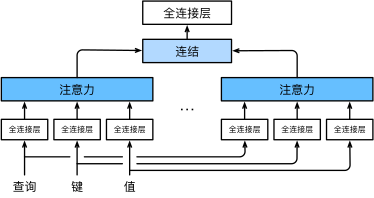
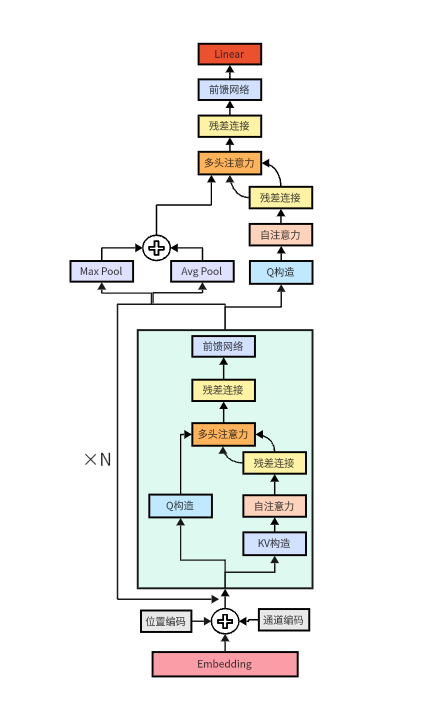

# Ark

## 一. 互联网环境现状

> 你能看出下面的评论是恶意评论吗?
>
> * 你是一个退休的伐木工，无斧又无木
> * 初升东西
> * 真是宋朝的开始，唐完了
> * 一个人拍照就是全家福

### 1. 背景

​		不知大家有没有注意到，现在的互联网风气越来越恶劣，漫骂声，争吵声，网络暴力不绝于耳。越来越多的人开始吧生活中的情绪，工作上的压力，家庭里的不满在网络上倾泻而出，把压抑已久的恶意在陌生人面前展现的淋漓尽致。

​		起初各大平台为了防范用户间的恶意，采用关键词检索方法审核用户评论。但久而久之，用户们开始用更高超的技巧反制平台的审核，其中最常见的方法就是采用**谐音字代替关键字**以及**语义复杂化**。

### 2. 谐音字代替关键字

​		谐音字代替关键字的核心思想就是，通过换字的方式逃过审核时关键词检索，如**无斧又无木**实际上是说**无父又无母**，**初升**实际上说的**畜生**。这种方式简单粗暴，但往往简单的东西反而皮实，为了制服这种谐音字评论，原始的关键词检索只能不断扩充它的词表，但这种方式治标不治本，只要再换个谐音字，关键词检索就又失效了。

### 3. 语义复杂化

​		这是一个更加高级的反制手段，同样想要使用这个手段的门槛也更高，它需要用户有深厚的语文功底，将恶意隐匿于无形，同时又不能太晦涩难懂，导致被骂的人浑然不知。如**唐完了**，**唐**指唐氏儿综合征，比起简单直当的**智障**两字，一句**唐完了**更显优雅。至于**一个人拍照就是全家福**，当然说的就是**孤儿**了。显而易见，语义复杂化后对关键词检索如同降维打击，傻傻的审核机制完全看不懂这到底在说些什么。

### 4. 何为$ark$

​		$ark$是一个基于多头注意力机制深层时序网络模型，目的是为了提出一种新的审核机制，以控制恶意的传播。

* 在数据处理上，$ark$将一个文本，分为**原始文本**，**拼音信息**，**声母信息**三通道，以应对谐音字代替关键字情况
* 在模型框架上，$ark$选择**多头注意力机制**，以捕捉道原语中携带的复杂信息。
* 在模型结构上，$ark$采用独特的**通道注意力机制**，每个单通道将会学到它与所有通道之间的关系。
* $ark$的名字来源于诺亚方舟$(Noah's\ Ark)$，寓意是带领人们走出网络恶意的方舟。

## 二. 注意力机制

### 1. 注意力机制的来源

注意力机制源于人类处理信息时**“有选择地关注重要部分”**的认知特点。我们在阅读一段文字或观察一幅图像时，并不会平均地分配注意力，而是更关注与当前任务相关的关键信息。将这一思想引入深度学习，便形成了注意力机制，其目的在于引导模型聚焦于输入信息中最相关的部分，从而提升处理复杂任务的能力。

### 2. 注意力机制的原理

注意力机制的核心思想在于构建一个“查询-键-值”（Query-Key-Value）三元组映射框架。给定一个查询向量（Query），系统会计算其与一组键（Key）之间的相似度得分，并据此对对应的值（Value）进行加权求和，最终生成上下文向量。

$$
\text{Attention}(Q, K, V) = \text{softmax} \left( \frac{QK^T}{\sqrt{d_k}} \right) V
$$

### 3. 多头注意力机制的原理

传统的单一注意力机制虽然可以聚焦重要信息，但其表示能力受到限制，往往难以同时捕捉多个维度的关联特征。而多头注意力机制通过设置多个“注意力头”，让每个头以不同的方式理解输入内容，从多个角度提取信息。最终，这些不同头的结果会被合并在一起，使得模型获得更丰富、更全面的表示。

## 三. $ark$的模型结构设计

> $ark$主要由三大层组成

* **Embedding层**负责提取输入携带的原始信息。
* **通道注意力层**通过原始信息提取更加深层的信息。
* **全局注意力层**通过通道注意力得到的深层信息，将全部信息整合后分类。

### 1. Embedding层

> 每个词元可以被分为三个通道，分别代表**原词，拼音，声母**

> 每个词元可以用唯一ID表示，并可以根据ID转化为**词向量**

> 一个词元有多个通道，便有多个词向量表示不同维度的特征

> 为了保留位置信息，对词向量添加位置编码

> 为了保留通道信息，对词向量添加通道编码

### 2. 通道注意力层

> (1). 当前层的输入为**X**$(通道数, 批量大小, 句子长度, 隐藏层大小)$
>
> (2). 将多通道在句子长度的维度拼接得到**Q**$(批量大小, 通道数 \times 句子长度, 隐藏层大小)$ ，即**每个通道的每个词元都会在多头注意力机制里查询一次**
>
> 
>
> (3). 将多通道在隐藏层维度拼接得到**KV**$(批量大小, 句子长度，通道数 \times 隐藏层大小)$，即**每个词元此时都包含三通道的完整信息**
>
> 
>
> (4). 复制**Q**的隐藏层大小至$通道数 * 隐藏层大小$，使其维度与**KV**相同，以计算注意力权重，每次计算注意力权重时相当于一个通道的信息与三个通道的信息计算关联信息。
>
> 
>
> (5). **Q**与**KV**进入$SelfAttention \rightarrow AddNorm \rightarrow multiHeadAttention \rightarrow AddNorm \rightarrow PositionWiseFFN$，得到结果O$(批量大小, 通道数 \times 句子长度, 通道数 \times 隐藏层大小)$
>
> 
>
> (6). 将**O**展平为$(批量大小, 通道数, 句子长度, 通道数, 隐藏层大小)$
>
> (7). 将**O**的**第1维度**信息汇聚得到**y**$(批量大小, 句子长度, 通道数, 隐藏层大小)$
>
> (8). 将**y**形状重排为$(通道数, 批量大小, 句子长度, 隐藏层大小)$, 重复操作$(1)$

### 3. 全局注意力层

> (1). 当前层的输入为**X**$(通道数, 批量大小, 句子长度, 隐藏层大小)$
>
> (2). 将**第0维度和第2维度**信息汇聚得到**GX**$(批量大小, 1, 隐藏层大小)$
>
> 
>
> (3). **GX**与**X**进入$SelfAttention \rightarrow AddNorm \rightarrow multiHeadAttention \rightarrow AddNorm \rightarrow PositionWiseFFN$，得到结果**PY**$(批量大小, 1, 隐藏层大小)$ 
>
> 
>
> (4). **PY**进入线性层分类得到结果**Y**$(批量大小, 类别数)$

## 四. 训练结果

### 1. 数据集分布

| 训练集 | 测试集 | 验证集 |
| ------ | ------ | ------ |
| 65291  | 7255   | 100    |

### 2. 性能指标结果

模型训练 20 个 Epoch 后，在测试集上的表现如下：

| 指标      | 数值     |
| --------- | -------- |
| Accuracy  | 0.867264 |
| Precision | 0.882371 |
| Recall    | 0.833237 |
| F1-score  | 0.857100 |
| FPR       | 0.101610 |

可以看出，模型在整体准确率上达到了 86.73%，精确率和召回率分别为 88.24% 与 83.32%，在保持较低误报率的同时，实现了对恶意评论的较强识别能力。F1 值也达到了 0.857，说明模型在精度和覆盖率之间取得了良好的平衡。

### 3. 混淆矩阵与 ROC 曲线（可视化）

### 4. 其他模型对比

| 模型名称                                    | 召回率 | 假阳率 | 准确率 | 精确率 |
| ------------------------------------------- | ------ | ------ | ------ | ------ |
| Ark                                         | 80%    | 22%    | 79%    | 78.43% |
| Tabularisai/Multilingual-Sentiment-Analysis | 78%    | 62%    | 56%    | 54.41% |
| SnowNLP                                     | 52%    | 34%    | 60%    | 60.47% |
| 国内大语言模型                              | 100%   | 0%     | 100%   | 0%     |

* Tabularisai/Multilingual-Sentiment-Analysis 为DistilBERT在多语言情感数据集上微调的模型，其设计旨在跨文化、跨语言场景中实现情感识别。然而，该模型在中文网络语料上表现一般，召回率尚可但误报率较高，导致整体准确率仅为56%。

* SnowNLP 作为基于朴素贝叶斯算法构建的中文情感分析工具，结构简单，推理速度快，但在复杂情感识别任务中的表现较弱。其召回率仅为52%，说明漏检率较高，难以有效识别恶意评论。朴素贝叶斯方法对特征独立性假设依赖较强，难以捕捉上下文关联与语义模糊表达。

* 国内大语言模型，如DeepSeek、智普清言、豆包等。在本次测试中表现出绝对优势，各项指标均达最优。然而，其优秀表现主要归因于百亿级别的参数与训练数据，在实际部署中面临高成本与高延迟的问题，限制了其在轻量级应用中的可用性。此外，该类模型在情感分类任务中通常依赖提示词实现，其表现受Prompt设计影响显著，稳定性仍有待提高。

综上所述，Ark模型在轻量化部署条件下保持了较好的准确率、召回率与鲁棒性，相比其他模型在实用性与性能间实现了较优的权衡。

## 五. $ark$的不足

1. $ark$的数据集$(7w+)$仍需要完善，数据面不够涵盖多方面的知识，好的数据集仍然是好模型的基础
2. $ark$的上下文只支持$128$，对于长序列$ark$暂时无法支持